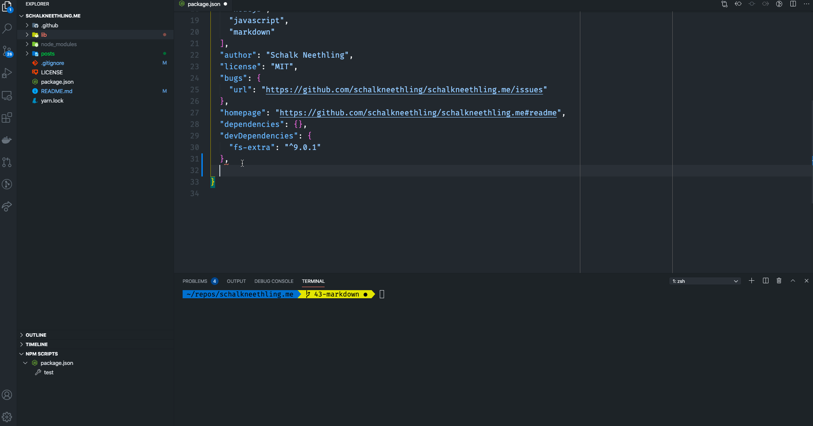

# project-calavera

[](https://project-calavera.readthedocs.io/?badge=latest)

A simple starting skeleton for common web projects. Bring your own frameworks.



## Using Calavera

### Prerequisites

To start with, you will need to have Nodejs installed. You can find instructions on the [Nodejs website](https://nodejs.org/).

Your next stop is to ensure that your project has a `package.json` file in the root of the project. If your project does not already have one, you can create one using the `npm init` or `yarn init` command from your command line/terminal.

With the above in place, you are ready to start using Calavera.

### Example Usage

Inside your `package.json` we will add a `calavera` config entry that will tell Calavera which configs to install. Calavera support the following config options:

- Prettier
- CSS
- SCSS
- ESLint

or a combination of the above. You can read details on each configuration in the [Calavera docs](https://project-calavera.readthedocs.io/).

Once you have added your chosen Calavera config, for exmaple:

```
"calavera": {
    "eslint": true,
    "prettier": true
}
```

Run the following from the root of your project:

```
npx project-calavera
```

This will add the required dot-files to your project. Once the command completes, it will output the command you should run to install the required dependencies:

> NOTE: Calavera by default prints the command for the Yarn dependency manager. If you prefer `NPM`, you can specify it as part of your Calavera config, for example:
>
> ```
> "calavera": {
>    "manager": "npm",
>    "eslint": true,
>    "prettier": true
> }
> ```

```
Run the following command to install your dependencies: npm i -D --save-exact babel-cli babel-preset-env eslint
```

Copy, paste and run the command in your terminal. Once complete, you are of to the races.

Make something awesome! 💀
